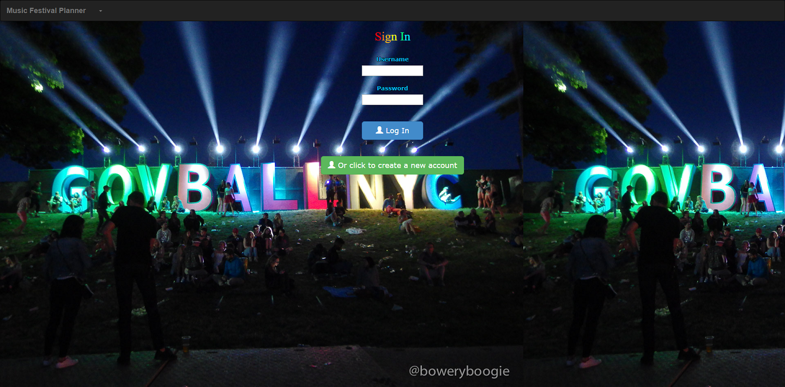
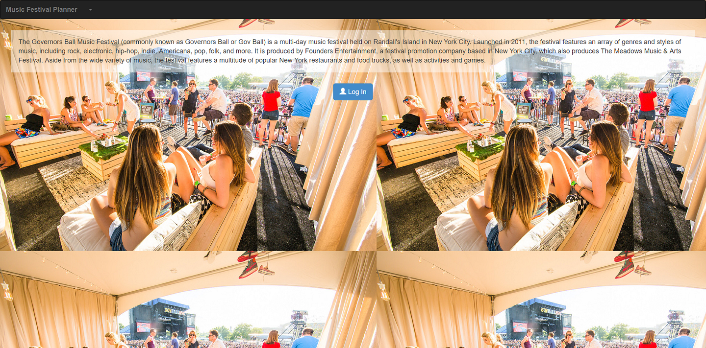
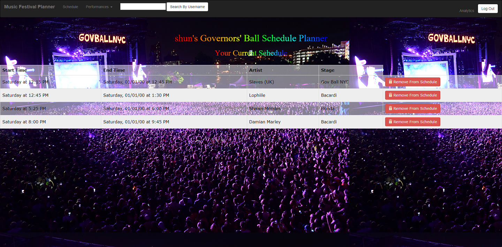
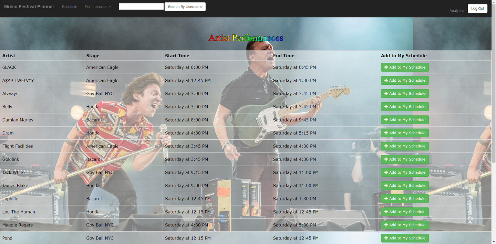
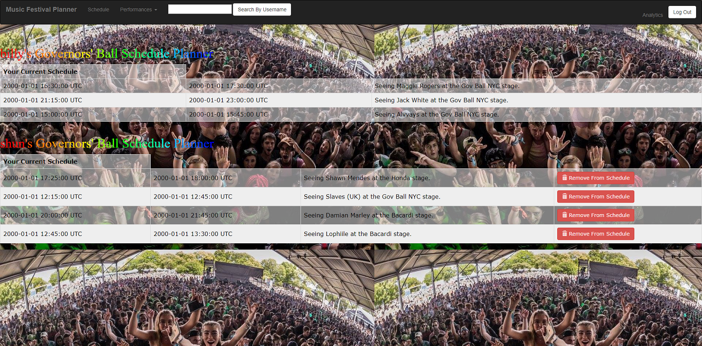

## Music Festival Planner
A music festival planner where users can add shows to their own schedules based on different artists, stages and performance times, as well as delete them. They can also view and compare their friends’ schedules. The app also provides analytics.

## Techinical Aspets
+ Built the entire web application using Ruby, Ruby on Rails and the MVC pattern
+ Used Bootstrap and custom CSS for styling
+ Created customized sorting and filtering algorithms for analytics
+ Implemented user validation and authentication using bcrypt

## Installation
<code>git clone https://github.com/rainANDshine/music-festival-planner</code>

<code>bundle</code>

<code>rails s</code>

## Credits
Built by [Gui Bin Zhang](https://github.com/gbzhang6), [Shun Yao](https://github.com/rainANDshine), [Yong-Nicholas Kim](https://github.com/yongnicholaskim), and [William Dale](https://github.com/dalewb)

## Screenshots

## License
MIT ©
